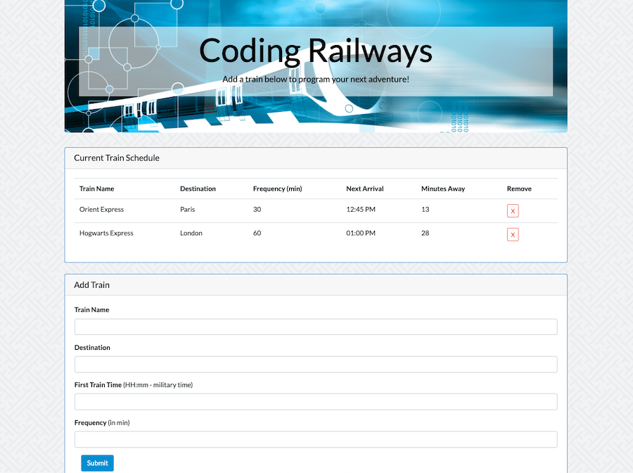

# Train-Scheduler

A dynamic train scheduling application that allows users to save train information and track details regarding each train's arrival time and frequency. It was built using JavaScript, jQuery, a Firebase database, HTML, CSS, and a Bootstrap theme. 

Visit the deployed site at: [Train Scheduler](https://michelle-88.github.io/Train-Scheduler/)

